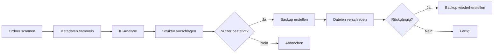

<div align="center">

```
    ############ #### ########   ####  ####     ##########    ####
    ############ #### ########   ####  ####     ##########    ####
        ####     #### ####  #### ####  ####     ####  ####    ####
        ####     #### ####  #### ####  ####     ####  ####    ####
        ####     #### ####  ####  ########      ##########    ####
        ####     #### ####  ####   ######       ##########    ####
        ####     #### ####  ####    ####        ####  ####    ####
        ####     #### ########      ####        ####  ####    ####
        ####     #### ########      ####        ####  #### ## ####
```

# TidyAI

### 🤖 KI-gestützte Dateiorganisation für Windows

[](https://www.microsoft.com/windows)
[](https://docs.microsoft.com/powershell/)
[](LICENSE)
[](https://github.com/HorosCloudOfficial/tidyai-german)

Verwandeln Sie chaotische Ordner in perfekt organisierte Strukturen mit nur einem Rechtsklick - powered by KI!


[🎬 Demo ansehen](#-tidyai-in-aktion) • [📥 Installation](#-installation) • [📚 Dokumentation](#-verwendung) • [🌍 Unix Version](Documentation/README_SHELL.md)

</div>

---

## ✨ Funktionen

### 🎯 Kernfunktionen
- **🤖 KI-gestützte Organisation** - Nutzt OpenAI oder Groq API für intelligente Dateiorganisation
- **📁 Windows Explorer Integration** - Rechtsklick-Kontextmenü für jeden Ordner
- **🛡️ 100% Sicher** - Keine Dateien werden gelöscht oder umbenannt, nur verschoben
- **🔄 Intelligentes Rückgängig-System** - Vollständig umkehrbar mit automatischen Backups
- **📦 Stapelverarbeitung** - Verarbeitet große Ordner (1000+ Dateien) effizient in Stapeln
- **⚡ Keine Abhängigkeiten** - Reines PowerShell, läuft sofort auf jedem Windows-System

### 🚀 Erweiterte Features
- **💰 Kostengünstig** - Unterstützt GPT-4o-mini und Groq (kostenlos!)
- **🎨 Intelligente Kategorisierung** - Erkennt Inhalte, nicht nur Dateitypen
- **📊 Vorschau vor Änderungen** - Zeigt vorgeschlagene Struktur vor der Ausführung
- **🔒 Datenschutz** - Dateien bleiben lokal, nur Metadaten werden an die API gesendet
- **⚙️ Anpassbar** - Modulare Architektur für individuelle Anpassungen

---

## 🎬 TidyAI in Aktion

<div align="center">

</div>

### Vorher / Nachher

**Vorher:**
```
Downloads/
├── document1.pdf
├── vacation_pic.jpg
├── meeting_notes.docx
├── random_video.mp4
├── presentation.pptx
└── ... (hunderte unorganisierte Dateien)
```

**Nachher:**
```
Downloads/
├── 📄 Dokumente/
│   ├── document1.pdf
│   ├── meeting_notes.docx
│   └── presentation.pptx
├── 🖼️ Bilder/
│   └── vacation_pic.jpg
└── 🎬 Videos/
    └── random_video.mp4
```

---

## 📥 Installation

### Schnellinstallation (Empfohlen)

1. **Repository herunterladen**
   ```powershell
   git clone https://github.com/HorosCloudOfficial/tidyai-german.git
   cd tidyai-german
   ```

2. **Installation starten**
   - Rechtsklick auf `TidyAI Installation/Setup.bat`
   - "Als Administrator ausführen" wählen

3. **API-Schlüssel einrichten**

   **Option A: OpenAI (GPT-4o-mini)**
   - API-Schlüssel von [platform.openai.com/api-keys](https://platform.openai.com/api-keys) holen
   - Während Installation eingeben
   
   **Option B: Groq (Kostenlos!)**
   - API-Schlüssel von [console.groq.com](https://console.groq.com) holen
   - Während Installation eingeben
   - Empfohlen für kostenloses Testen

### Manuelle Installation

```powershell
# API-Schlüssel setzen
setx TidyAIOpenAIAPIKey "dein-api-schlüssel-hier"

# Installationsskript ausführen
.\TidyAI Installation\Install-TidyAI.ps1
```

---

## 📖 Verwendung

### Einfache Nutzung

1. **Rechtsklick** auf einen beliebigen Ordner im Windows Explorer
2. Wähle **"🧹 Mit TidyAI aufräumen"**
3. Überprüfe die vorgeschlagene Struktur
4. Bestätige die Organisation
5. Fertig! ✨

### Erweiterte Optionen

#### Manuelle Ausführung
```powershell
# TidyAI auf einen bestimmten Ordner anwenden
.\TidyAI Scripts\TidyAI.ps1 -Path "C:\Pfad\zum\Ordner"
```

#### API-Provider wechseln
```powershell
# Groq API verwenden (kostenlos)
$env:TIDYAI_PROVIDER = "groq"

# OpenAI API verwenden
$env:TIDYAI_PROVIDER = "openai"
```

---

## 🔄 Rückgängig-System

TidyAI's intelligentes Rückgängig-System macht jede Organisation vollständig umkehrbar:

### Wie es funktioniert

1. **📸 Automatisches Backup**
   - Vor jeder Organisation wird eine `.tidyai` Backup-Datei erstellt
   - Speichert die komplette ursprüngliche Struktur
   - Versteckt und sicher

2. **↩️ Rückgängig machen**
   - Nach der Organisation erscheint ein Prompt
   - Wähle "Rückgängig", um alles wiederherzustellen
   - Oder "Behalten", um die neue Struktur zu behalten

3. **🔍 Intelligente Erkennung**
   - Erkennt bereits organisierte Ordner
   - Bietet automatisch das Rückgängigmachen an
   - Verhindert versehentliche Doppel-Organisation

### Rückgängig-Beispiel
```powershell
# Manuelles Rückgängigmachen
.\Modules\Core\UndoSystem.ps1 -Path "C:\Pfad\zum\Ordner"
```

---

## 🏗️ Architektur

### Modulare Struktur

```
TidyAI/
├── 📂 Modules/
│   ├── AI/              # KI-Integration (OpenAI/Groq)
│   ├── Core/            # Kernfunktionalität
│   ├── Organizer/       # Dateiorganisation
│   └── Scanner/         # Ordner-Scanning
├── 📂 TidyAI Scripts/   # Hauptskripte
├── 📂 TidyAI Installation/ # Setup & Deinstallation
└── 📂 Documentation/    # Dokumentation
```

### Workflow



---

## 🔧 Konfiguration

### Umgebungsvariablen

| Variable | Beschreibung | Standard |
|----------|--------------|----------|
| `TidyAIOpenAIAPIKey` | API-Schlüssel (OpenAI/Groq) | - |
| `TIDYAI_PROVIDER` | API-Provider (`openai`/`groq`) | `openai` |
| `TIDYAI_MODEL` | Verwendetes Modell | `gpt-4o-mini` |
| `TIDYAI_BATCH_SIZE` | Stapelgröße für große Ordner | `200` |

### Anpassung

```powershell
# Eigenes Modell verwenden
$env:TIDYAI_MODEL = "gpt-4o"

# Stapelgröße ändern
$env:TIDYAI_BATCH_SIZE = "500"
```

---

## ❓ FAQ

<details>
<summary><strong>Ist TidyAI kostenlos?</strong></summary>

TidyAI selbst ist kostenlos und Open Source. API-Kosten:
- **Groq**: Komplett kostenlos! 🎉
- **OpenAI GPT-4o-mini**: ~0,15$ pro 1000 Anfragen (sehr günstig)
</details>

<details>
<summary><strong>Werden meine Dateien hochgeladen?</strong></summary>

Nein! Nur Dateinamen, Größen und grundlegende Metadaten werden an die API gesendet. Dateiinhalte bleiben lokal.
</details>

<details>
<summary><strong>Was passiert, wenn die Organisation fehlschlägt?</strong></summary>

TidyAI erstellt immer ein Backup. Bei Fehlern bleibt der Ordner unverändert oder kann mit dem Rückgängig-System wiederhergestellt werden.
</details>

<details>
<summary><strong>Kann ich die Kategorien anpassen?</strong></summary>

Ja! Die KI lernt aus dem Kontext. Sie können auch die Prompts in `Modules/AI/PowerShell Scripts/PromptBuilder.ps1` anpassen.
</details>

<details>
<summary><strong>Funktioniert es mit großen Ordnern (1000+ Dateien)?</strong></summary>

Ja! TidyAI nutzt intelligente Stapelverarbeitung für große Ordner.
</details>

---

## 🛠️ Deinstallation

### Option 1: Windows Systemsteuerung
1. `Win + R` → `appwiz.cpl`
2. "TidyAI" auswählen
3. "Deinstallieren"

### Option 2: Deinstallationsskript
```powershell
.\TidyAI Installation\Uninstall-TidyAI.ps1
```

Entfernt automatisch:
- ✅ Kontextmenü-Einträge
- ✅ Umgebungsvariablen
- ✅ Registry-Einträge
- ✅ Programmverknüpfungen

---

## 🤝 Mitwirken

Wir freuen uns über Beiträge! 

### Entwicklung

1. Repository forken
2. Feature Branch erstellen (`git checkout -b feature/NeuesFeature`)
3. Änderungen committen (`git commit -m 'Neues Feature hinzugefügt'`)
4. Branch pushen (`git push origin feature/NeuesFeature`)
5. Pull Request öffnen

### Ideen für Beiträge
- 🌍 Weitere Sprach-Übersetzungen
- 🎨 UI-Verbesserungen
- 🐛 Bug-Fixes
- 📚 Dokumentations-Verbesserungen
- ⚡ Performance-Optimierungen

---

## 📜 Lizenz

Dieses Projekt ist unter der MIT-Lizenz lizenziert - siehe [LICENSE](LICENSE) für Details.

---

## 🙏 Danksagungen

- **Ursprünglicher Entwickler**: [Geet Batth](https://github.com/geetbatth)
- **Deutsche Version**: HorosCloudOfficial
- **KI-Provider**: OpenAI & Groq
- **Community**: Alle Contributors und Tester

---

## 📞 Support & Kontakt

- 🐛 **Bug Reports**: [GitHub Issues](https://github.com/HorosCloudOfficial/tidyai-german/issues)
- 💡 **Feature Requests**: [GitHub Discussions](https://github.com/HorosCloudOfficial/tidyai-german/discussions)
- 📧 **Email**: horoscloudofficial@gmail.com

---

<div align="center">

**Made with ❤️ and 🤖 AI**

⭐ Wenn dir TidyAI gefällt, gib uns einen Stern auf GitHub!

[⬆️ Nach oben](#tidyai)

</div>
