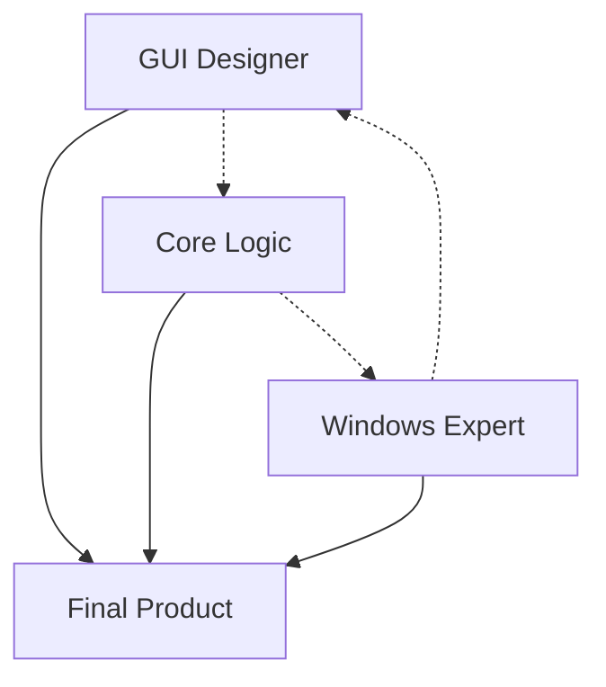

# 🚀 HAMMER TEAM - Directory Manager Specialists

## Team Zusammenstellung

### 👥 Core Team Members

1. **[Project Manager Elite](project-manager-elite.md)** 🎯
   - **Rolle**: Senior Project Coordination & Team Management
   - **Mission**: Team orchestration and quality assurance
   - **Expertise**: Agile management, code review, performance tracking

2. **[GUI Designer Profi](gui-designer.md)** 🎨
   - **Rolle**: Senior WPF/XAML UI/UX Designer
   - **Mission**: Hammer hochglanz Windows GUI
   - **Expertise**: Modern WPF, Fluent Design, Animations

3. **[Core Logic Architect](core-logic-architect.md)** 🧠
   - **Rolle**: Backend Logic & Algorithm Specialist  
   - **Mission**: Blazing fast directory scanning engine
   - **Expertise**: Async algorithms, file system operations

4. **[Windows System Expert](windows-system-expert.md)** 🪟
   - **Rolle**: Windows API & Integration Specialist
   - **Mission**: Deep Windows system integration
   - **Expertise**: Native APIs, permissions, shell integration

## 🎯 Team Mission
**"Der ultimative Directory Clean-up Manager für Windows!"**

### Projekt Ziele
- ✅ **Leere Ordner** finden und löschen
- ✅ **Leere Dateien** bereinigen  
- ✅ **.part Dateien** aufspüren
- ✅ **Moderne GUI** mit hammer Design
- ✅ **Native Windows** Integration

### Team Synergies

## 🛠️ Tech Stack
- **Frontend**: WPF + XAML + Fluent Design
- **Backend**: C# + .NET 6+ + Async/Await
- **System**: Windows APIs + File System + Registry
- **Pattern**: MVVM + Command Pattern + Observer

Das Team ist **ready to rock** für LOs Directory Manager! 💪🚀