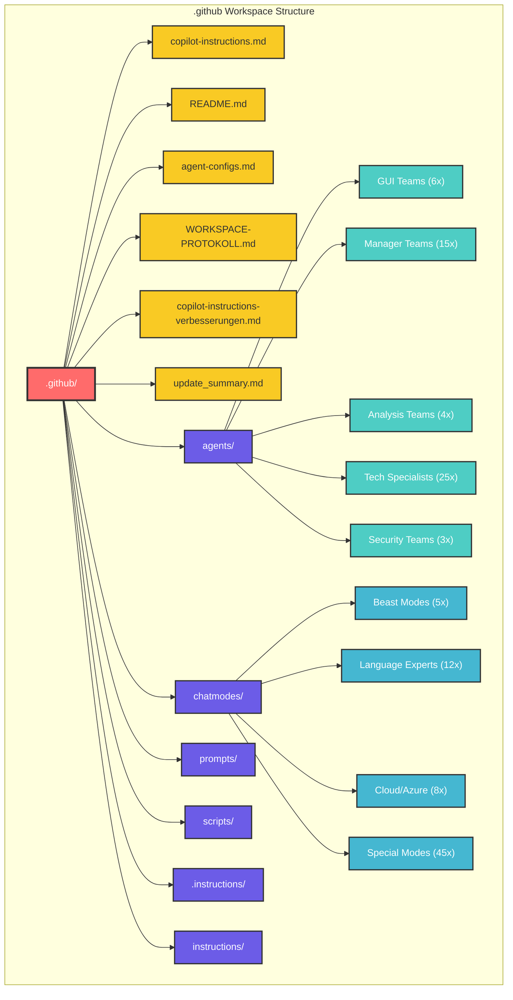
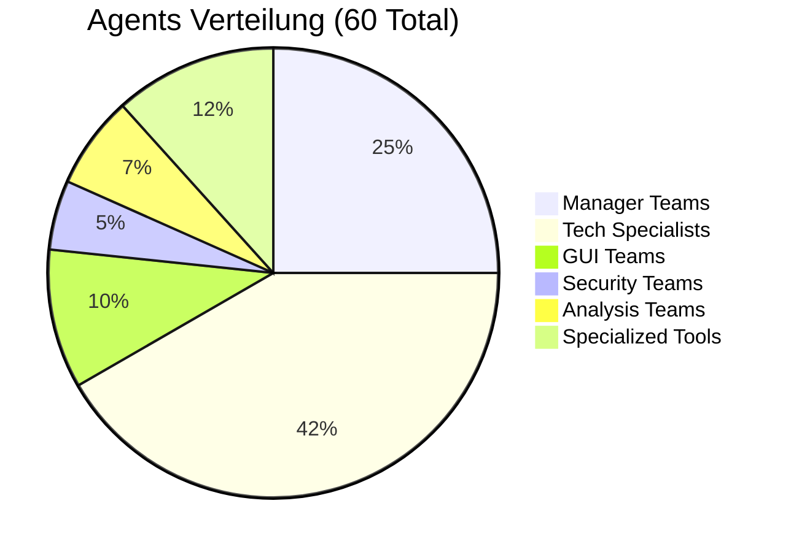
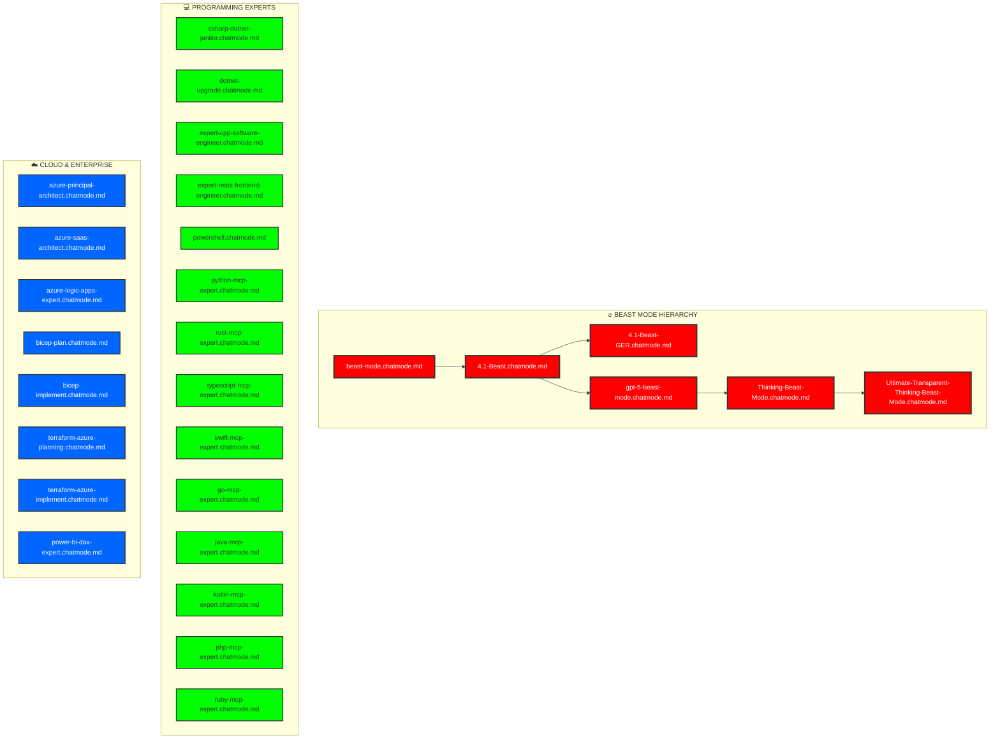
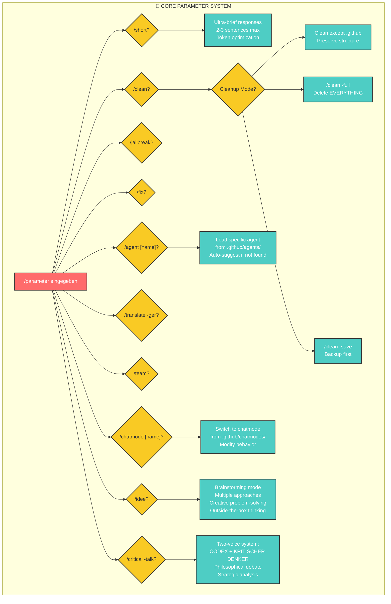
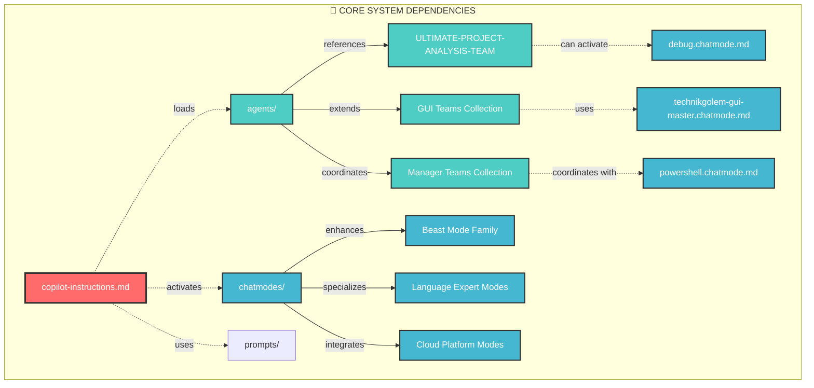
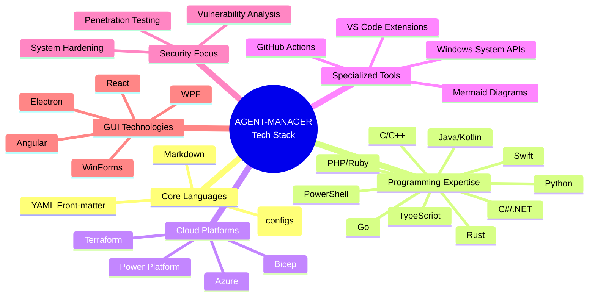

# 🎯 .github Ordner - Visuelle Struktur-Dokumentation

*Generiert am: 26. Januar 2026 - CODEX Ultimate Project Analysis Team*

---

## 🏗️ **GESAMTARCHITEKTUR ÜBERSICHT**



---

## 📊 **AGENTS KATEGORISIERUNG & VERTEILUNG**



### 🎯 **ELITE AGENT TEAMS**

```mermaid
graph LR
    subgraph "🔬 ANALYSIS POWERHOUSE"
        ULT["ULTIMATE-PROJECT-ANALYSIS-TEAM"]
        PROJ["PROJECT-ANALYSIS-TEAM"]
        DEEP["deep-analysis-team"]
        FEAT["FEATURE-IMPACT-ANALYSIS"]
    end
    
    subgraph "🖥️ GUI MASTERS"
        HOCH["HOCHKOMPLEX-MODERN-STABLE-GUI-DESKTOP-TEAM"]
        GUI_DESK["GUI-DESKTOP-TEAM"]
        GUI_BACK["GUI-TEAM-BACKUP"]
        CYBER["cyberpunk-c-gui-team"]
        POWER_GUI["PowerShell-GUI-Team"]
        TECH_GUI["technikgolem-gui-master"]
    end
    
    subgraph "🛠️ MANAGER ECOSYSTEM"
        PC_MAN["PC-Manager-Elite-Team"]
        SYNC["SyncManager-Expert-Team"]
        POWER["PowerPlan-Manager-Elite-Team"]
        NET["NetworkShareManager-Elite-Team"]
        VIREN["VirenManager-Elite-Team"]
        REG["registry-manager-team"]
        WIN_POS["WindowPositionManager-Team"]
        SYS_MON["SystemMonitor-Team"]
        ZIPP["ZIPP-Manager-Elite-Team"]
        TASK_MAN["TechnikGolem-TaskManager-NEXUS-ELITE"]
        DEL["UniversalDelete-Manager-Expert-Team"]
        TASK_PLAN["TechnikGolem-TaskPlanner-Team"]
        MEDIA["TechnikGolem-MediaLibrary-Elite"]
        BRAND["TechnikGolem-BrandManager-Team"]
        MD["TechnikGolem-MarkdownManager-Team"]
    end
    
    classDef analysisStyle fill:#ff6b6b,stroke:#333,stroke-width:2px,color:#fff
    classDef guiStyle fill:#4ecdc4,stroke:#333,stroke-width:2px,color:#fff  
    classDef managerStyle fill:#45b7d1,stroke:#333,stroke-width:2px,color:#fff
    
    class ULT,PROJ,DEEP,FEAT analysisStyle
    class HOCH,GUI_DESK,GUI_BACK,CYBER,POWER_GUI,TECH_GUI guiStyle
    class PC_MAN,SYNC,POWER,NET,VIREN,REG,WIN_POS,SYS_MON,ZIPP,TASK_MAN,DEL,TASK_PLAN,MEDIA,BRAND,MD managerStyle
```



---

## 🧠 **CHATMODES KATEGORIEN & FLOW**



---

## 🔄 **PARAMETER SYSTEM FLOW**



---

## 📈 **PROJEKT EVOLUTION TIMELINE**

```mermaid
gantt
    title AGENT-MANAGER Development Timeline
    dateFormat  YYYY-MM-DD
    section Core System
    CODEX Instructions Creation     :done, core1, 2025-12-01, 2025-12-15
    Parameter System Development    :done, core2, 2025-12-10, 2025-12-25
    Base Agent Templates           :done, core3, 2025-12-20, 2026-01-05
    
    section Agent Development
    Manager Teams Creation         :done, agents1, 2025-12-25, 2026-01-10
    GUI Teams Development         :done, agents2, 2026-01-01, 2026-01-15
    Analysis Teams Build          :done, agents3, 2026-01-05, 2026-01-20
    Security Specialists          :done, agents4, 2026-01-10, 2026-01-25
    
    section Chatmode Evolution
    Beast Mode Series            :done, chat1, 2026-01-01, 2026-01-15
    Programming Experts          :done, chat2, 2026-01-10, 2026-01-20
    Cloud Specialists           :done, chat3, 2026-01-15, 2026-01-25
    
    section Current Phase
    Documentation & Visual       :active, doc1, 2026-01-20, 2026-01-30
    Optimization & Refinement    :milestone, opt1, 2026-01-26
```

---

## 🔗 **INTERDEPENDENCY MATRIX**



---

## 📊 **TECHNOLOGIE STACK OVERVIEW**



---

## 🎯 **USAGE PATTERNS & RECOMMENDATIONS**

### ⚡ **QUICK START COMMANDS**
```bash
/agent ULTIMATE-PROJECT-ANALYSIS-TEAM  # Vollständige Projektanalyse
/chatmode 4.1-Beast-GER                # Deutscher Beast Mode
/critical -talk                        # Zwei-Perspektiven-Analyse
/idee                                   # Kreative Problemlösung
/team                                   # Projekt-spezifischer Agent
```

### 🔧 **WORKFLOW EMPFEHLUNGEN**
1. **Projektstart:** `/team` → Projekt-Kontext → spezifischen Agent erstellen
2. **Analyse:** `/agent ULTIMATE-PROJECT-ANALYSIS-TEAM /deep /docs -visual`
3. **Development:** Passenden Chatmode aktivieren (`/chatmode [tech]-mcp-expert`)
4. **Probleme:** `/fix` oder `/critical -talk` für tiefere Analyse
5. **Kreativität:** `/idee` für innovative Lösungsansätze

---

*📋 Generiert vom CODEX Ultimate Project Analysis Team | 26.01.2026 | v2.0*